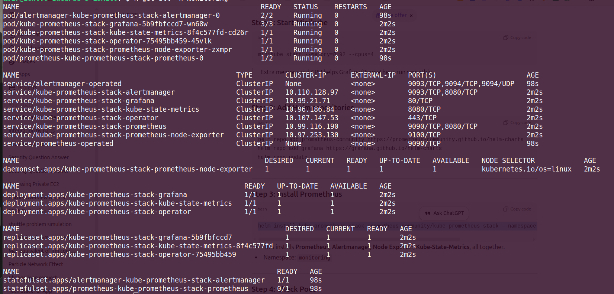
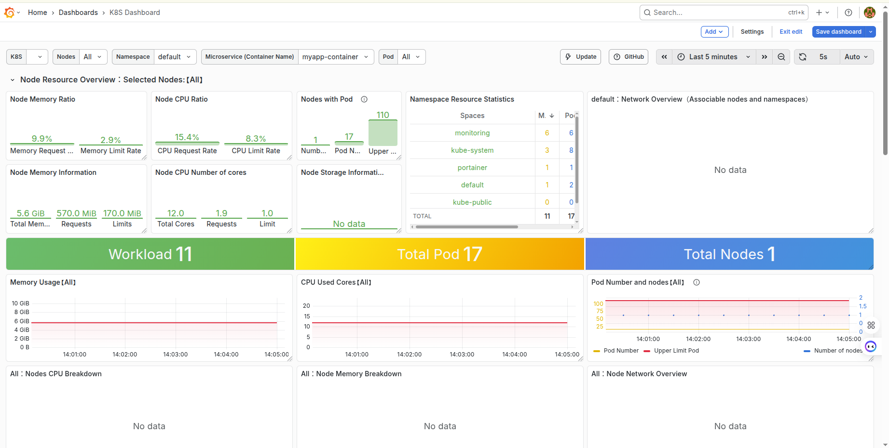

# Kubernetes Deployment with Prometheus and Grafana Monitoring

 DevOps project that demonstrates containerized application deployment on Kubernetes with observability using Prometheus and Grafana. The application is a Multi-Converter web service (length, weight, temperature, volume, currency, number base) built with Flask, containerized with Docker, and deployed to a Kubernetes cluster with Horizontal Pod Autoscaling. Monitoring is implemented with Prometheus for metrics collection and Grafana for visualization and alerting.

---

## Table of Contents

- [Overview](#overview)
- [Tech Stack](#tech-stack)
- [Architecture](#architecture)
- [Prerequisites](#prerequisites)
- [Project Structure](#project-structure)
- [Local Development](#local-development)
- [Docker Build and Run](#docker-build-and-run)
- [Kubernetes Deployment](#kubernetes-deployment)
- [Monitoring Stack](#monitoring-stack)
- [Application Endpoints](#application-endpoints)
- [Testing](#testing)
- [Skills Demonstrated](#skills-demonstrated)

---

## Overview

This project covers the full lifecycle from application code to production-style deployment:

1. **Application**: Flask-based Multi-Converter API with health and info endpoints suitable for probes and service discovery.
2. **Containerization**: Multi-stage-ready Dockerfile (Python 3.11 Alpine) with non-root user and explicit resource exposure.
3. **Orchestration**: Kubernetes manifests for Deployment, Service (NodePort), and HorizontalPodAutoscaler (HPA).
4. **Observability**: Prometheus and Grafana deployed in the cluster for application and cluster metrics, with dashboards for workload and node visibility.

Target audience: Junior DevOps Engineers and SREs building experience in CI/CD, Kubernetes, and monitoring.

---

## Tech Stack

| Layer | Technology |
|-------|------------|
| Application | Python 3.11, Flask 3.x, Waitress (production WSGI) |
| Container | Docker, Python 3.11 Alpine base |
| Orchestration | Kubernetes (Deployment, Service, HPA) |
| Monitoring | Prometheus (metrics), Grafana (dashboards) |
| Testing | pytest, pytest-cov, pytest-flask |

---

## Architecture

- **Pods**: Application runs as multiple replicas (min 2) behind a Deployment, with CPU/memory limits and requests defined.
- **Service**: NodePort exposes the app on a cluster node port for external access.
- **HPA**: Scales the Deployment between 2 and 10 replicas based on CPU (70% target) and memory (80% target) utilization.
- **Monitoring**: Prometheus scrapes metrics from the cluster and application; Grafana queries Prometheus and displays dashboards for pods, nodes, and custom metrics.


---

## Prerequisites

- **Docker**: For building and running the application image.
- **kubectl**: Configured to talk to your Kubernetes cluster (minikube, kind, EKS, GKE, AKS, or on-prem).
- **Kubernetes cluster**: With metrics-server installed (required for HPA).
- **Optional**: Helm, for installing Prometheus and Grafana (e.g. kube-prometheus-stack).

---

## Project Structure

```
.
├── backend/
│   ├── app/
│   │   __init__.py      # Flask app factory
│   │   routes.py        # API and health routes
│   ├── config.py
│   └── utils/
│       converters.py    # Conversion logic
├── templates/           # Flask HTML templates
├── static/              # CSS, JS assets
├── k8s-manifests/
│   ├── deployment.yaml  # App Deployment (replicas, resources)
│   ├── service.yaml     # NodePort Service
│   └── hpa.yaml         # HorizontalPodAutoscaler
├── imgs/                # Screenshots for docs
│   ├── runningAllpods.png
│   ├── dashboardGrafana.png
├── Dockerfile
├── requirements.txt
├── run.py               # Entrypoint (Waitress)
└── tests/               # pytest tests
```

---

## Local Development

**Linux / macOS**

```bash
python -m venv venv
source venv/bin/activate
pip install -r requirements.txt
python run.py
```

**Windows (PowerShell)**

```bash
python -m venv venv
.\venv\Scripts\Activate.ps1
pip install -r requirements.txt
python run.py
```

The app listens on `http://localhost:5000`.

---

## Docker Build and Run

Build the image:

```bash
docker build -t converter-app .
```

Run the container:

```bash
docker run -p 5000:5000 converter-app
```

Access at `http://localhost:5000`. For Kubernetes, push the image to a registry your cluster can pull from (e.g. Docker Hub). The manifests reference `jubair2002/multiconverter-app:v1`; adjust image name and tag in `k8s-manifests/deployment.yaml` to match your registry.

---

## Kubernetes Deployment

1. **Build and push image** (example for Docker Hub):

   ```bash
   docker build -t <your-registry>/multiconverter-app:v1 .
   docker push <your-registry>/multiconverter-app:v1
   ```

   Update `image` in `k8s-manifests/deployment.yaml` if you use a different name or tag.

2. **Apply manifests** (order does not matter for this set; ensure Service selector matches Deployment pod labels):

   ```bash
   kubectl apply -f k8s-manifests/deployment.yaml
   kubectl apply -f k8s-manifests/service.yaml
   kubectl apply -f k8s-manifests/hpa.yaml
   ```

3. **Verify**:

   ```bash
   kubectl get pods -l app=myapp
   kubectl get svc converter-app-service
   kubectl get hpa converter-app-hpa
   ```

4. **Access the app**: Use the NodePort shown by `kubectl get svc`:

   ```bash
   kubectl get svc converter-app-service
   # Use <NodeIP>:<NodePort> in browser or curl
   ```

**Running pods (example)**

Pods for the Multi-Converter app after applying the Deployment and HPA:



---

## Monitoring Stack

Prometheus and Grafana are run in the same cluster to monitor the application and cluster resources. A common approach is to use the **kube-prometheus-stack** Helm chart, which deploys Prometheus Operator, Prometheus, Grafana, and default scrape configs for Kubernetes metrics.

**Example install (Helm 3):**

```bash
helm repo add prometheus-community https://prometheus-community.github.io/helm-charts
helm repo update
helm install prometheus prometheus-community/kube-prometheus-stack \
  --namespace monitoring --create-namespace
```

After installation:

- **Prometheus**: Port-forward or use Ingress to reach the Prometheus UI and run PromQL queries.
- **Grafana**: Get the admin password from the Grafana secret in the `monitoring` namespace, then port-forward or use Ingress to open the Grafana UI. Add Prometheus as a data source (URL usually `http://prometheus-kube-prometheus-prometheus.monitoring.svc:9090` or as per your release name).

**Grafana dashboard example**

Below is a sample Grafana dashboard used for cluster and workload monitoring (CPU, memory, pod status, etc.):



**Additional screenshot**


You can create custom dashboards and alerts in Grafana based on Prometheus metrics from your application and the cluster.

---

## Application Endpoints

| Endpoint | Method | Description |
|----------|--------|-------------|
| `/` | GET | Web UI (Multi-Converter) |
| `/health` | GET | Health check (returns JSON; suitable for readiness/liveness probes) |
| `/api/info` | GET | Application name, version, features |
| `/api/units` | GET | Available units per converter type |
| `/api/convert/length` | POST | Length conversion |
| `/api/convert/weight` | POST | Weight conversion |
| `/api/convert/temperature` | POST | Temperature conversion |
| `/api/convert/volume` | POST | Volume conversion |
| `/api/convert/currency` | POST | Currency conversion |
| `/api/convert/number-base` | POST | Number base conversion |

Example health check:

```bash
curl http://<host>:<port>/health
# {"message":"Application is running","status":"healthy"}
```

Use `/health` in Kubernetes readiness and liveness probes if you add them to the Deployment.

---

## Testing

Unit and route tests are implemented with pytest:

```bash
pip install -r requirements.txt
pytest
```

With coverage:

```bash
pytest --cov=backend --cov-report=term-missing
```

Configuration is in `pytest.ini`.

---

## Skills Demonstrated

- **Containers**: Dockerfile authoring, non-root user, minimal base image (Alpine).
- **Kubernetes**: Deployments, Services (NodePort), resource requests/limits, labels and selectors.
- **Scaling**: Horizontal Pod Autoscaler with CPU and memory metrics.
- **Observability**: Prometheus and Grafana integration, dashboards for cluster and application.
- **Application design**: Health and info endpoints, structured API, suitable for production-style deployment.
- **Automation**: Declarative manifests, repeatable deployment with `kubectl apply`.
- **Testing**: Automated tests and coverage for backend and routes.

